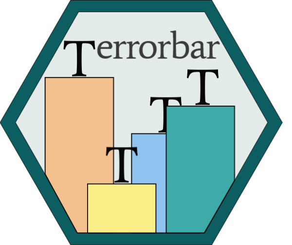

# Introducing `geom_terrorbar()` 

Create galaxy-brain-level errorbars like in *THAT* paper

## Motivation

In July 2022, a [now retracted
paper](https://www.hindawi.com/journals/amse/2022/3802603/) appeared in
a special issue of a Hindawi journal Advances in Materials Science and
Engineering, that contained a bar chart with the letter <span
style="font-family:Times New Roman">T</span> pasted above bars,
presumably as a substitute for error bars.

I strongly believe that everyone should be able to quickly produce this
genius graphics. That is the only purpose of `ggterror`, an extension to
`R`’s `ggplot2` package. Unlike the graphics in the original – and this
word is doing a lot of work here – paper, however, this extension
produces actual errorbars.

## Installation

You can install `ggterror` from github using the `remotes` package:

``` r
# install.packages("remotes")
remotes::install_github("mivalek/ggterror")
```

## Usage

The package contains a single function `geom_terrorbar()` that should be
used in much the same way as `ggplot2::geom_errorbar()`

``` r
library(ggplot2)
library(ggterror)
library(palmerpenguins)
library(dplyr)

palmerpenguins::penguins |>
    dplyr::filter(!is.na(body_mass_g)) |>
    dplyr::group_by(species) |> 
    dplyr::summarise(
        mean = mean(body_mass_g),
        se = sd(body_mass_g) / sqrt(dplyr::n())
        ) |>
        ggplot(aes(x = species, y = mean)) +
        geom_terrorbar(aes(ymin = mean - 2 * se,
                           ymax = mean + 2 * se)) +
        geom_point() +
        theme_bw()
```

<!-- -->

On top of the usual aesthetics you’d pass to `ggplot2::geom_errorbar()`,
this function takes a few additional arguments that govern the overal
look of the <span style="font-family:Times New Roman">T</span>s and the
connecting lines:

- `connect` - logical. Whether or not the <span
  style="font-family:Times New Roman">T</span>s should be connected with
  a line.
- `fontface` - one of `c("plain", "bold", "italic")`
- `size` - size of the <span
  style="font-family:Times New Roman">T</span>s in pt units
- `line_type` - type of connecting line when `connect = TRUE`
- `line_width` - width of connecting line when `connect = TRUE`
- `line_alpha` - alpha for connecting line when `connect = TRUE`. By
  default, `line_alpha = 0.6 * alpha` of the <span
  style="font-family:Times New Roman">T</span>s

Reproducing the original plot is easy with `geom_terrorbar()`:

``` r

library(ggtext)

df <- tibble::tibble(
  x = factor(1:5, labels=c("blank", "pink", "lysozyme", "hOGG1", "Endo IV")),
  y = c(3.5, .5, 3.4, 3.2, 3),
  ymax = y + .2,
  ymin = y - .2,
  size = 15
)

df |> ggplot(aes(x, y)) +
  geom_terrorbar(aes(ymax = ymax, ymin = ymin), connect = FALSE) +
  geom_bar(stat = "identity", aes(fill = x), colour="black", width = .65, lwd = .7) +
  labs(x = "", y = "Current (<em>&mu;</em>A)") +
  scale_y_continuous(limits = c(0,4.3), expand=c(0,0)) +
  theme_classic() +
  scale_fill_manual(values=c("#f3c08f", "#f9ee87", "#3eaba8", "#8fc4f1", "#cecece")) +
  theme(
    panel.background = element_rect(colour = "black", fill = NA, size = .85),
    axis.text = element_text(family="serif", size = 15),
    axis.title.y = element_markdown(family = "serif", size = 15),
    axis.ticks = element_blank()) +
  guides(fill = "none")
```

<!-- -->

Hope you have fun creating some true classics!
